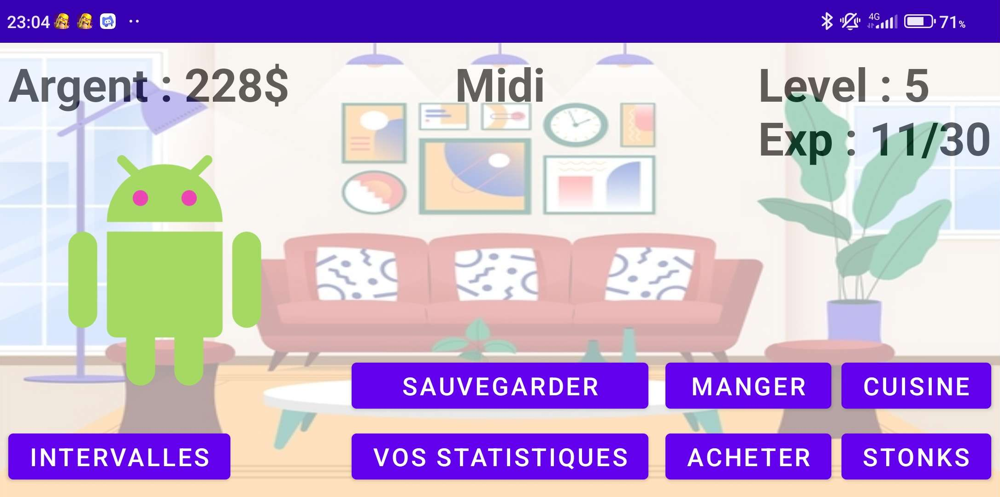
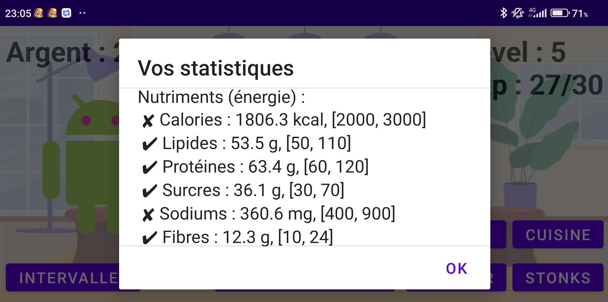
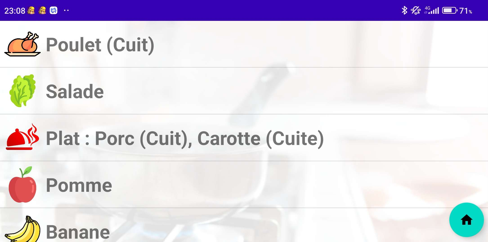

An educational Android game designed to teach healthy eating habits.

## 🎓 School Project Information

|  |  |
|--|--|
| Team   | 2 |
| Course | Object-Oriented Programming |
| School | Sorbonne Université |

## ✨ Overview

- In this game, players assume the role of a character with various attributes such as level, money, nutrients, and inventory.

- The objective is to survive while keeping nutrients (calories, proteins, etc.) within defined ranges.

- To achieve this, players can eat and cook different foods.

- To acquire these foods, players must purchase them from a supermarket using money earned through working.

- To work, players participate in a quiz game, where they have to answer questions related to nutrition.

## 📥 Download

---

  Copyright &#169; 2021 PyroWilDx. All Rights Reserved.

